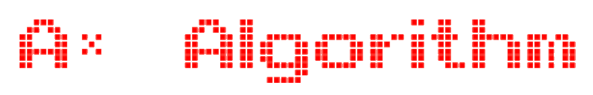

# A* (A Star)

> Introducción

* Los algoritmos de busqueda de caminos mínimos ha sido un punto de investigación por durante décadas. El 1956, Edsger Dijkstra introdujo el revolucionario algoritmo de Dijkstra. Lo que este hacía era calcular el camino mínimo en un grafo ponderado con pesos positivos para llegar de un nodo aribitrario de inicio a otro de fin. Este algoritmo ha sido y aún es utilizado por muchísimas áreas tales como la telefonía con redes de telefono que tratan de minimizar el camino por el cual una señal es transmitida, la reservación de pasajes para minimizar el costo de transportarse de un lado a otro, y en el cálculo de direcciones de GPS tales como Waze y Google Maps para entregarle al cliente el camino más optimo para llegar de un lado a otro. Sin embargo, el uso del algoritmo de Dijkstra tiene una característica que podría ser considerada como un defecto. Esta es que no toma en cuenta ningún sentido de dirección a la hora de encontrar un camino. Es por esta razón que se desarrolló el algoritmo de A* (o A star) que basicamente viene a ser una extension del algoritmo de Dijkstra. 

> Porqué A*?

* El algoritmo de A* funciona de una manera parecida al algoritmo de Dijkstra, pero le agrega el elemento de distancia y dirección. Cuando se hace la búsqueda del camino, si sólo se utilizara el algoritmo de dijkstra, este solo buscaría un camino con el menor peso posible, sin embargo lo hará sin tener idea alguna de hacia donde debería dirigir este camino. La implementación de A* hará que al tener un sentido de dirección y distancia, algunos nodos que hubieran sido visitados por el algoritmo de dijkstra ya no sean visitados y así ahorrar una cantidad significativa de cálculo.

# Resumen del Programa

* Nuestro programa se basará en calcular el camino mínimo de un mapa que estará representado a través de una red cuadrada con obstáculos. Este caso es el mismo al presentado en el apartado anterior donde todas las aristas en el grafo tienen pesos iguales. Por otra parte, nuestro programa además tendrá que enfrentarse al problema de calcular el camino al evitar obstáculos que serán repartidos en el mapa de manera aleatoria. El mapa será representado con nodos y cada uno de estos será asignado un estado que luego se utilizará para poder demostrar el camino en la consola. Cabe recalcar que el camino no tomará en cuenta un nodo diagonalmente adyacente a él. 

> Flujo del programa
  * Ingresar la dimensión del mapa
  * Ingresar la cantidad de obstaculos que se generarán en el mapa
    * La cantidad de obstaculos que el mapa podrá tener es el 20% del total de nodos para evitar que los nodos de inicio o fin sean encerrados muy frecuentemente.
  * Calcular el camino mínimo (en caso exista uno)
    * En caso exista uno quiere decir que podría existir reparticiones de obstáculos que encierren al nodo de inicio o nodo final, lo cual eliminala posibilidad de encontrar un camino entre ellos
  * Imprimir el mapa con el camino mínimo en la consola

> Consideraciones
* En esta implementación del algoritmo, se ha optado por utilizar la distancia física como la función heurisitca. Sin embargo, esto no siempre va a ser necesariamente el caso. Es por esta razón que se ha utilizado programación genérica para poder pasar cualquier tipo de función heuristica al algoritmo de solución. 
* Por otra parte, en uno de los pasos del algoritmo, se requiere iterar por todos los nodos adyacentes al nodo actualmente seleccionado. Sin embargo, esto se hace de manera secuencial y a la hora de tener mapas de mayores dimensiones, el desempeño del programa se podría ver afectado. Es por esta razón que se ha utilizado programación concurrente para poder procesar todos los nodos adyacentes al nodo actualmente seleccionado de forma paralela.

# Code insights 
Para el desarrollo del proyecto se implementó la clase Mapa, el struct Nodo y el enum Estado; con el propósito de permitir una mejor interacción entre las acciones del programa . Además, se hizo uso de templates en algunos métodos (actualizar_adyacentes_thread y a_star) para poder mejorar y generalizar el código. 

> Enlace de video

https://www.youtube.com/watch?v=DzO5QslIeZA

## Equipo

> Contribuyentes

| <a target="_blank">**Francisco Magot Barrera**</a> | <a target="_blank">**Marcela Espinoza Herrara**</a> | <a target="_blank">**Isaac Vera Romero**</a> |
| :---: | :---:| :---:|
|  |  | | 
| <a href="https://github.com/panchomb" target="_blank">`github.com/panchomb`</a> | <a href="https://github.com/marcelaespinoza" target="_blank">`github.com/marcelaespinoza`</a> | <a href="https://github.com/IsaacVera10" target="_blank">`github.com/IsaacVera10`</a> |

# Bibliografía 
* Chatterjee. (24 de abril de 2020). _A* Search Algorithm in Artificial Intelligence (AI)_. GreatLearning. https://www.mygreatlearning.com/blog/a-search-algorithm-in-artificial-intelligence/
* Computerphile. (2017). _A* (A Star) Search Algorithm - Computerphile_.[Video]. https://www.youtube.com/watch?v=ySN5Wnu88nE.
* Computerphile. (2017). _Dijkstra's Algorithm - Computerphile_.[Video]. https://youtu.be/GazC3A4OQTE.
* Edureka. (2020). _A* Algorithm in AI | A Star Search Algorithm | Artificial Intelligence Tutorial | Edureka_.[Video]. https://youtu.be/amlkE0g-YFU.
* GeeksforGeeks. (21 de agosto de 2020)._Applications of Dijkstra’s shortest path algorithm_. GeeksforGeeks. https://www.geeksforgeeks.org/applications-of-dijkstras-shortest-path-algorithm/ 
* Javidx9. (2018). _Path Planning - A* (A-Star)_. [Video]. https://www.youtube.com/watch?v=icZj67PTFhc.

